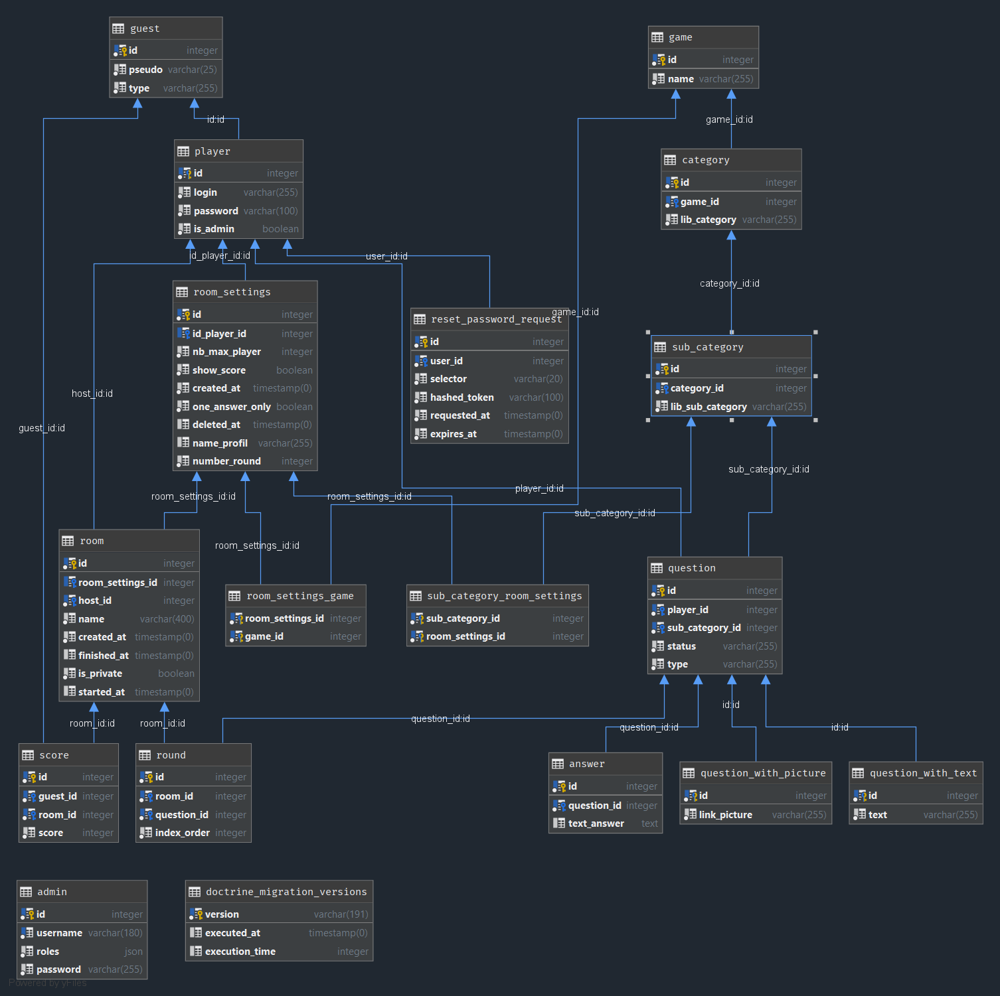

# MAGMA #

## Site : ## 
https://magma-mercurehub.herokuapp.com/ 
(les parties ne fonctionnent pas car il fallait un hébergeur qui supporte le GO et qui a un accès SSH mais il fonctionne en local, pour jouer avec plusieurs comptes vous pouvez ouvrir une fenêtre en navigation privée)

## Script SQL : ##
[SQL](doc/game.sql) 

## installation du projet : ##

composer

    composer install

NodeJS

    yarn

    yarn dev

Setup de mercure:

    cd mercure

windows : 

    setup		

linux ( jamais testé ): 

    MERCURE_PUBLISHER_JWT_KEY=TheMercureGameKey \
    MERCURE_SUBSCRIBER_JWT_KEY=TheMercureGameKey \
    ./mercure run -config Caddyfile.dev

## Technologies: ##
- PHP
- Composer
- Symfony:
    - Twig
    - Doctrine
    - Webpack-Encore-Bundle
    - Mercure-Bundle
    - Messenger
    - Knp-Paginator-Bundle
    - EasyAdmin-Bundle
    - Faker
    - Apache-pack
    - Security-Bundle
- JavaScript:
    - JQuery
    - JSON
- CSS:
    - Bootstrap
- Mercure Hub:
    - GO
    - Caddy
- API:
    - https://http.cat/
    - Mercure

## Diagramme de classe : ##

## KANBAN : ##
https://github.com/QUENTlN/game/projects/1

## Compte: ##
- Rôle d'utilisateur :
  Vous pouvez en créer un propre à vous en choisissant de vous inscrire, sinon voici des identifiants déja disponibles !
  - Nom d’utilisateur :
  - Mot de passe : azerty

- Rôle de modérateur :
  - Nom d’utilisateur : moderateur@test.fr
  - Mot de passe : azerty

- Rôle d’admin :
  - Le formulaire de connexion se trouve sur la route “/admin/login”.
  - Nom d’utilisateur : admin
  - Mot de passe : admin
- Serveur SMTP : pour l'envoi de mail nous utilisons un faux serveur SMTP fourni par mailtrap.io, pour visualiser les différents mails envoyés, veuillez suivre ces étapes :
  - Dirigez vous vers le site : https://mailtrap.io
  - Cliquez sur "Log in" situé en haut à droite
  - "Use Google account"
  - @mail : symfonytest69@gmail.com
  - mot de passe : KeFg7JfPOneffc9E
  - Vous voilà connecté ! Vous pouvez visualiser vos mails dans la section "Inboxes" puis dans "My inbox"

## Fonctionnalités: ##
- Page d'accueil
    - Consulter les Room publiques ouvertes
    - Rejoindre une Room publique
    - Aller vers la page de création de Room publique ou privé si l’on est connecté
    - Un système de pagination affiche 10 salons par pages
- Page connexion
    - Authentification à l’aide du mail et du mot de passe de l’utilisateur
    - Mot de passe oublié : envoi d’un mail avec un lien qui expire au bout d’une heure. Ce lien amène l’utilisateur vers une page lui permettant de changer de mot de passe. Gestion des erreurs : si le lien n’est plus valide, si les mots de passe ne correspondent pas, si le mot de passe est trop court, si le mail ne correspond à aucun mail déjà enregistré. 
- Page inscription
    - Formulaire d’inscription : email, pseudo, mot de passe, confirmation de mot de passe
    - Constitue un nouveau Player dans la base de données avec comme unique rôle USER.
    - Gestion des erreurs : mot de passe trop court, mots de passe ne correspondant pas, email mal renseigné ou déjà existant, champs non renseignés
- Back-office
    - Dashboard : lien vers les différentes pages du back-office et sur la page d’accueil du site. Quelques statistiques sur les joueurs, salons, et paramètres de salons
    - CRUD (Create, Read, Update, Delete) pour différentes entités :
        - Player
        - Guests
        - Question
        - Rooms
        - Room Settings
        - Category
        - SubCategory
    - Un eventSubscriber a été implémenté afin de gérer le hachage du mot de passe, EasyAdmin laissant le mot de passe en clair. Cet eventSUbscriber intervient juste avant le persist d’un objet d’une entité, et vérifie si l’entité persistée est de type Player, si oui alors une fonction permettant le hachage du mdp est appelée.
- Page de suggestion de question
    - Uniquement si l’utilisateur a un compte et est connecté
    - Formulaire permettant le choix du jeu et de la catégorie/sous-catégorie de questions qui seraient liées à cette question, l’énoncé de la question et sa/ses réponses.
    - Un bouton “ajouter” permet de, dynamiquement, ajouter un champ pour ajouter une réponse.
- Page de gestion des questions en attente de validation
    - Uniquement accessible si l’utilisateur connecté a un rôle de modérateur
    - Vue des différentes questions avec le statut “Pending” ainsi que leur jeu/catégorie/sous-catégorie associé(e)(s)
    - 3 possibilités d’actions :
    - Modifier la question
    - Accepter la question (la question passe en statut “Accepted”)
    - Supprimer la question (la question passe en statut “Rejected”)
- Page profil
    - Uniquement si l’utilisateur est connecté
    - Affichage des informations de l’utilisateur : son email, son pseudo
    - Lien vers la page de modifications des informations du profil : l’email et le pseudo
    - Lien vers la page de modification du mot de passe
    - Bouton déconnexion
    - Visualisation des paramètres de salons enregistrées par l’utilisateur
    - Lien vers la page de création de paramètres de salon  
- Page de création de paramètres de salon
    - Accessible uniquement si l’utilisateur est connecté
    - Formulaire permettant de remplir les différents paramètres de la room (nom du profil, nombre de joueurs maximum, nombre de tours, et les sous catégories de questions présentes dans la salle)
    - Auto-complétion lors de la saisie du choix des questions : lorsqu’un jeu est coché, tout ce qui est lié à lui l’est aussi, de même pour les catégories et sous catégories.
- Salon de jeu
    - Rejoindre un salon et prévenir tous les autres participants que vous êtes présent
    - L’host peut lancer la partie pendant que les autres joueurs ont un écran d’attente
    - Les joueurs peuvent répondre à la question jusqu'à la fin du temps imparti ou jusqu'à ce qu’il réponde correctement
    - Lorsque tous les rounds sont terminés le tableau des scores s’affiche
    - Une fois le score affiché l’host peut relancer la partie
- Autre
    - Page d’erreurs personnalisée par une API
    - La traduction est disponible en anglais sur tout le site depuis la barre de navigation, et grâce à une gestion d’événements qui permet de changer la langue de la session.
    - Gestion des différents rôles, restriction d’accès à travers les pages : modérateur, player et anonyme / guest.
  

